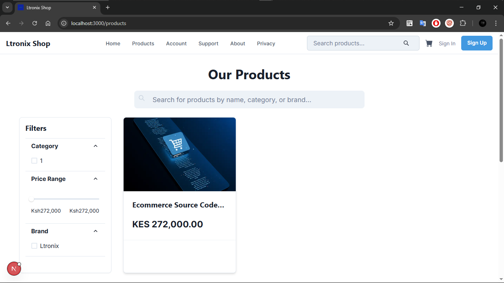

# Ltronix Shop

Ltronix Shop is a full-stack e-commerce platform built with a modern architecture, featuring a decoupled frontend and backend, automated CI/CD pipelines, and infrastructure as code.



## Table of Contents

- [Project Overview](#project-overview)
- [Key Features](#key-features)
- [Tech Stack](#tech-stack)
- [Project Structure](#project-structure)
- [Getting Started](#getting-started)
  - [Prerequisites](#prerequisites)
  - [Installation](#installation)
- [Usage](#usage)
- [Database](#database)
- [Deployment](#deployment)
- [CI/CD](#cicd)
- [Infrastructure](#infrastructure)
- [Troubleshooting](#troubleshooting)
- [Contributing](#contributing)
- [License](#license)

## Project Overview

Ltronix Shop is designed to provide a seamless online shopping experience. It features a user-friendly interface for customers and a powerful admin dashboard for managing products, orders, and users. The application is built with a decoupled architecture, with a Django backend serving a REST API and a Next.js frontend consuming it. This separation of concerns allows for independent development and scaling of the frontend and backend.

## Key Features

-   **User Authentication:** Secure user registration and login with local email/password and social providers (Google).
-   **Product Catalog:** Browse and search for products with detailed descriptions and images.
-   **Shopping Cart:** Add products to a shopping cart and manage its contents.
-   **Checkout:** A streamlined checkout process with support for M-Pesa payments.
-   **Order Management:** View order history and track order status.
-   **Admin Dashboard:** A comprehensive admin panel for managing products, orders, and users.
-   **Responsive Design:** A mobile-friendly interface that works on all devices.

## Tech Stack

### Backend

-   **Framework:** [Django](https://www.djangoproject.com/), [Django Rest Framework](https://www.django-rest-framework.org/)
-   **Database:** [PostgreSQL](https://www.postgresql.org/)
-   **Async Tasks:** [Celery](https://docs.celeryq.dev/en/stable/), [Redis](https://redis.io/)
-   **Authentication:** [django-allauth](https://django-allauth.readthedocs.io/en/latest/), [Simple JWT](https://django-rest-framework-simplejwt.readthedocs.io/en/latest/)
-   **Payments:** [django-daraja](https://github.com/kopokopo/django-daraja) (M-Pesa)
-   **Deployment:** [Docker](https://www.docker.com/), [Gunicorn](https://gunicorn.org/)

### Frontend

-   **Framework:** [Next.js](https://nextjs.org/), [React](https://reactjs.org/)
-   **UI:** [Chakra UI](https://chakra-ui.com/)
-   **State Management:** [Zustand](https://zustand-demo.pmnd.rs/), [React Query](https://tanstack.com/query/v4)
-   **HTTP:** [Axios](https://axios-http.com/)
-   **Authentication:** [NextAuth.js](https://next-auth.js.org/)
-   **Deployment:** [Vercel](https://vercel.com/)

### Infrastructure

-   **Cloud Provider:** [AWS](https://aws.amazon.com/)
-   **Infrastructure as Code:** [Terraform](https://www.terraform.io/)
-   **Services:** EC2, RDS, S3, ElastiCache, VPC, CloudWatch

### CI/CD

-   **Platform:** [GitHub Actions](https://github.com/features/actions)
-   **Backend:** Docker image build and push to GitHub Container Registry, Terraform deployment to AWS.
-   **Frontend:** Deployment to Vercel.

## Project Structure

```
ltronix-shop/
├── .github/          # GitHub Actions workflows for CI/CD
├── .venv/            # Python virtual environment
├── docs/             # Project documentation
├── ecommerce/        # Django backend project
│   ├── ecommerce/    # Django project settings and configurations
│   ├── payment/      # Django app for payment processing
│   ├── store/        # Django app for the main store functionality
│   └── users/        # Django app for user management
├── frontend/my-app/  # Next.js frontend application
│   ├── public/       # Static assets for the frontend
│   └── src/          # Frontend source code
├── infra/terraform/  # Terraform infrastructure as code
├── nginx/            # Nginx configuration for reverse proxy
└── ...
```

## Getting Started

### Prerequisites

-   [Docker](https://www.docker.com/get-started)
-   [Docker Compose](https://docs.docker.com/compose/install/)
-   [Node.js](https://nodejs.org/en/download/) and [npm](https://www.npmjs.com/get-npm)
-   [Python](https://www.python.org/downloads/) and [pip](https://pip.pypa.io/en/stable/installation/)

### Installation

1.  **Clone the repository:**

    ```bash
    git clone https://github.com/ndunguloren96/ltronix-shop.git
    cd ltronix-shop
    ```

2.  **Set up environment variables:**

    -   In the `ecommerce` directory, copy `.env.example` to `.env` and fill in the required values.
        ```bash
        cp ecommerce/.env.example ecommerce/.env
        ```
    -   In the `frontend/my-app` directory, copy `.env.example` to `.env.local` and fill in the required values.
        ```bash
        cp frontend/my-app/.env.example frontend/my-app/.env.local
        ```

3.  **Build and run the application:**

    ```bash
    docker-compose up --build
    ```

## Usage

-   **Frontend:** `http://localhost:3000`
-   **Backend API:** `http://localhost:8000/api/v1/`
-   **Django Admin:** `http://localhost:8000/admin/`

To access the Django admin panel, you need to create a superuser account. You can do this by running the following command in a separate terminal:

```bash
docker-compose exec backend python manage.py createsuperuser
```

## Database

The application uses a PostgreSQL database running in a Docker container. You can connect to the database using the following credentials (from your `.env` file):

-   **Host:** `your_host`
-   **Port:** `your_port_number`
-   **Username:** `you_username`
-   **Password:** `your_database_password`
-   **Database Name:** `your_database_name`

## Deployment

The application is designed for deployment to AWS and Vercel. The `docker-compose.yml` file can be adapted for production use, and the Terraform scripts will provision the necessary AWS resources.

## CI/CD

The project uses GitHub Actions for continuous integration and continuous deployment.

-   **Backend:** The backend workflow (`.github/workflows/backend.yml`) lints, tests, builds a Docker image, and deploys the infrastructure to AWS.
-   **Frontend:** The frontend workflow (`.github/workflows/frontend.yml`) lints, tests, builds, and deploys the frontend to Vercel.

## Infrastructure

The infrastructure is managed with Terraform. The configuration in `infra/terraform/` defines the AWS resources required to run the application.

## Troubleshooting

-   **`docker-compose up` fails:** Ensure that Docker and Docker Compose are properly installed and running. Also, check that you have created the `.env` files with the correct values.
-   **Frontend can't connect to the backend:** Verify that the `NEXT_PUBLIC_DJANGO_API_URL` in `frontend/my-app/.env.local` is set to `http://localhost/api/v1`.
-   **"Permission denied" errors:** You may need to run `docker-compose` with `sudo`.

## Contributing

Contributions are welcome! Please open an issue or submit a pull request.

## License

This project is licensed under the [MIT](./LICENSE) License.
